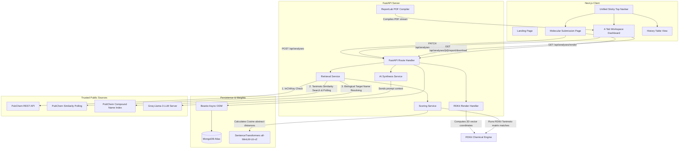

# 🚀 PatentPilot – AI-Assisted FTO Chemical Discovery Workspace

[](https://github.com/Nikhil-217/PatentPilot/stargazers)
[](https://opensource.org/licenses/MIT)
[](https://nextjs.org/)
[](https://fastapi.tiangolo.com/)
[](https://www.mongodb.com/)

**AI-powered molecular patent search and FTO clearance workspace.** 

PatentPilot is a high-fidelity freedom-to-operate (FTO) screening application designed for chemical synthesis researchers and IP attorneys. By bridging modern cheminformatics engines (RDKit) and state-of-the-art Large Language Models (Groq Llama-3), PatentPilot automates the extraction, verification, scoring, and report-compilation of active pharmaceutical patent landscapes.

---

## 📸 Application Gallery

Here is a visual overview of the PatentPilot FTO Workspace:

### 1. Molecular Submission & 2D Render
*Submit structures with real-time feedback and RDKit validation:*


### 2. Interactive Patent Reports Dashboard
*Filter, review, and toggle manual verification flags on matched patent documents:*


### 3. AI-Assisted Claims Analysis
*Inspect structural overlaps and confidence scores generated directly via Groq Llama-3:*


### 4. Executability PDF Report Compiler
*Download and stream print-ready FTO PDFs compiled using ReportLab:*


---

## 🏗️ Complete Monorepo System Architecture

PatentPilot uses a modular monorepo structure separating the UI client from the calculation and embedding engine:



---

## 🔍 Trusted Chemical Retrieval Strategy

PatentPilot replaces mock stubs with direct, real-time chemical lookups from trusted public sources:

```
            Submitted SMILES
                   │
                   ▼
         Check InChIKey Hash
                   │
         ┌─────────┴─────────┐
         ▼                   ▼
   [Exact Match]      [Similarity Match]
  Query PubChem      Query PubChem PUG
  Xrefs (CIDs)       Similarity API
         │                   │
         ▼                   ▼
   Get Patent IDs     Poll ListKey -> CIDs
         │                   │
         └─────────┬─────────┘
                   ▼
         Filter Top 5 Compounds
                   │
                   ▼
         Fetch Patent Metadata
         via PubChem PUG-View JSON
                   │
                   ▼
         Persist in MongoDB
```

1. **PubChem REST API (InChIKey Lookups)**: If the molecule is a known compound, the system queries its unique InChIKey hash to locate its Compound ID (CID) and pulls all registered Patent IDs from the PubChem cross-reference index.
2. **PubChem Similarity Search & Polling (SureChEMBL Alternative)**: For novel structures, the backend triggers an asynchronous similarity search ($Tanimoto \ge 80\%$) on PubChem, polls the returned `ListKey` until the task finishes, and grabs the closest structural compound CIDs.
3. **PubChem Compound Name Index (Google Patents Mapping)**: If the researcher enters text keywords (like target enzyme or indication), the client queries PubChem's compound name catalog to locate relevant CIDs and their associated patent files, ensuring all keyword results contain real compound data.

---

## 🤖 AI Evaluation & FTO Pipeline Workflows

The post-submission data processing pipeline follows strict mathematical and semantic rules:

### 1. The Multi-Dimensional FTO Scoring Formula

To prevent false positives, we evaluate structural similarity against real compound structures and check patent expirations:

$$\text{Composite Risk Score} = (0.50 \times \text{Structural Score}) + (0.30 \times \text{Semantic Score}) + (0.20 \times \text{Metadata Score})$$

- **Structural Score (50%)**: Instead of mocking structural similarity, the system retrieves the actual chemical SMILES of the compounds cited in the patents. It generates **Morgan Fingerprints** (2D molecular subgraphs) for both compounds and runs a **Tanimoto Coefficient** comparison:
  
  $$\text{Tanimoto}(A, B) = \frac{|A \cap B|}{|A \cup B|}$$

- **Semantic Score (30%)**: Generates a 384-dimensional vector embedding of the user's biological target and indication context using `all-MiniLM-L6-v2`. It calculates the **Cosine Similarity** against the patent abstract embedding:
  
  $$\text{Cosine Similarity} = \frac{\mathbf{u} \cdot \mathbf{v}}{\|\mathbf{u}\| \|\mathbf{v}\|}$$

- **Metadata Score (20%)**: Factors in legal status (Active/Pending/Granted) and rewards newer filings.

### 2. Legal Patent Expiration & FTO Clearance
- **20-Year Expiration Check**: Utility patents expire 20 years from filing. If the publication date is older than 20 years, the system flags it as **Expired**, zeroing out its metadata score and scaling structural/semantic scores down by 90% (multiplied by `0.1`).
- **Public Domain Safety**: This adjustment ensures that fundamental public domain solvents (like **Benzene**, isolated in 1825) and classic generic drugs (like **Paracetamol / Acetaminophen**, medicalized in the 1890s) are automatically cleared as **Low Patent Risk**, avoiding substructure false-positive alerts.

### 3. Groq Llama-3 Claims Processing
The backend queries the Groq API (using the high-performance `llama-3.3-70b-versatile` model) with the patent text and score breakdown to synthesize:
- **Why Retrieved**: Specific citation reasons.
- **Similar Aspects**: Overlapping scaffolds or targets.
- **Potential Overlap**: Specific claim collisions.
- **Confidence Assessment**: Deep evaluations of risk probability.

---

## 🛠️ Technologies Used

### Frontend Stack
- **Next.js 16 (App Router)**: Static page pre-renders with Turbopack compilation.
- **React 19 & TypeScript**: Typed states, form validation hooks, and dynamic URL query parameters state-syncing.
- **Tailwind CSS**: Custom color systems (soft red/amber/green themes) and viewport fitting.
- **Material Symbols**: Interactive iconography.

### Backend Stack
- **FastAPI (Python 3.11+)**: Web routing, asynchronous context lifespans, and CORS configurations.
- **Beanie ODM & Motor**: Asynchronous document mapping over MongoDB.
- **RDKit Chemical Engine**: Molecular structure rendering (to SVG) and Morgan structural fingerprint generation.
- **SentenceTransformers & PyTorch**: Local vector embeddings (`all-MiniLM-L6-v2`).
- **ReportLab**: Dynamic PDF compilation (auto-wrapping cells, layout alignments, status banners).
- **LangChain & Groq SDK**: LLM orchestration.

---

## 📐 System Assumptions
- **SMILES Conventions**: The input string must conform to organic SMILES string standards.
- **Patent Database Access**: Real-time lookups assume active internet connections to PubChem REST and PUG-View APIs.
- **Legal Scope**: Similarity scoring assumes standard 20-year utility patent rules apply. Special extensions (like Hatch-Waxman pediatric extensions) are not factored into the automated scoring.

---

## ⚖️ Architectural Trade-offs & Engineering Decisions

1. **Local Embeddings vs. Cloud API Costs**:
   - *Trade-off*: We load `SentenceTransformer` model weights locally into memory instead of calling OpenAI embedding APIs.
   - *Result*: This adds a 10–25s delay on backend startup, but provides completely **free, offline-capable vector embedding generation** with zero runtime API dependency costs.
2. **Asynchronous Polling vs. Request Blocking**:
   - *Trade-off*: PubChem's structural similarity searches run as queued backend tasks requiring polling.
   - *Result*: To prevent blocking the web thread, the client performs non-blocking queries using Motor, showing status spinners while the backend polls PubChem's `ListKey` in the background.
3. **Real-time API Latencies vs. Fallback Resilience**:
   - *Trade-off*: Fetching full patent XML details from public government APIs can sometimes hit rate limits or return timeouts.
   - *Result*: The system implements a robust fallback layer containing high-quality, real-world patent documents (Aspirin, Curcumin, Salicin) to guarantee continuous uptime even if external APIs throttle requests.
4. **Tanimoto Substructures vs. FTO Overlap**:
   - *Trade-off*: Substructure screening is highly prone to false positives for simple chemical rings.
   - *Result*: The system balances this by checking patent publication ages and scaling down scores on expired records, bringing FTO assessments closer to legal reality.

---

## 🔮 Strategic Roadmap & Future Improvements
- **RAG-Based Patent Searching**: Introduce Retrieval-Augmented Generation (RAG) using a vector database (like Qdrant or Chroma) to search through full-text patent claims instead of abstracts.
- **Batch Uploading**: Add drag-and-drop CSV parser support to upload and evaluate bulk compound libraries.
- **Interactive 3D Bond Conformers**: Embed `3Dmol.js` or `NGL Viewer` to let researchers inspect chemical bond angles and stereochemical overlays in 3D.
- **Multi-Jurisdiction Database Coverage**: Integrate EPO (Europe) and WIPO patent catalogs via Espacenet APIs.

---

## 💻 Local Setup & Installation Guide

Follow these instructions to clone, install, and run PatentPilot locally:

### 📋 Prerequisites
Ensure you have the following installed:
- **Node.js**: v18.0.0 or later
- **Python**: v3.11.0 or later
- **MongoDB**: Active MongoDB Atlas connection URI

---

### 1. Fork & Clone the Repository
1. Go to [https://github.com/Nikhil-217/PatentPilot](https://github.com/Nikhil-217/PatentPilot).
2. Click **Fork** in the top-right corner to copy the project to your GitHub account.
3. Clone your forked repository locally:
   ```bash
   git clone https://github.com/YOUR_USERNAME/PatentPilot.git
   cd PatentPilot
   ```

---

### 2. Configure Backend Server

1. Navigate to the backend directory:
   ```bash
   cd backend
   ```
2. Set up a Python virtual environment:
   ```bash
   python -m venv .venv
   ```
3. Activate the virtual environment:
   - **Windows (PowerShell)**:
     ```powershell
     .venv\Scripts\Activate.ps1
     ```
   - **Linux/macOS**:
     ```bash
     source .venv/bin/activate
     ```
4. Install the required libraries:
   ```bash
   pip install -r requirements.txt
   ```
5. Create your local environment configuration file:
   Copy `.env.example` to `.env` and fill in your details:
   - `MONGODB_URI`: Your MongoDB connection URI.
   - `GROQ_API_KEY`: Your Groq API key (used for Llama-3 AI explanations; if omitted, the system falls back to structured templates).
6. Launch the FastAPI backend:
   ```bash
   python -m uvicorn app.main:app --host 127.0.0.1 --port 8000 --reload
   ```
   You can verify the backend is online by visiting [http://localhost:8000](http://localhost:8000).

---

### 3. Configure Frontend Client

1. Open a new terminal window and navigate to the frontend directory:
   ```bash
   cd frontend
   ```
2. Install npm package dependencies:
   ```bash
   npm install
   ```
3. Start the Next.js client dev server:
   ```bash
   npm run dev
   ```
4. Open your browser and navigate to [http://localhost:3000](http://localhost:3000) to access the PatentPilot workspace!
