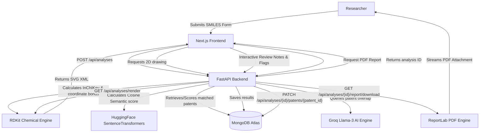

# PatentPilot – AI-Assisted FTO Workspace

PatentPilot is a high-fidelity monorepo application designed to help scientific researchers and intellectual property (IP) experts explore freedom-to-operate (FTO) clearances for botanical chemical derivatives and novel drug formulations. 

The platform allows users to submit molecular structures (via SMILES notation), calculate 2D chemical layouts, index matching patents, review specific overlapping claims through an interactive workspace, and compile PDF patentability summaries.

---

## 🏗️ System Architecture & Monorepo Layout

PatentPilot is designed as a unified monorepo divided into two distinct services:
1. **`/frontend`**: A Next.js (React) application configured with Next.js Turbopack for compilation and static page generation. It manages state rendering, debounced 2D molecular canvas fetches, researcher review inputs, and unified top navigation tabs.
2. **`/backend`**: A FastAPI (Python) web server that interfaces with RDKit for chemical processing, SentenceTransformers for semantic indexing, and MongoDB (via Beanie ODM) for document persistence.

### Data Flow Diagram



---

## 🔍 Retrieval & Scoring Strategy

The backend employs a hybrid scoring algorithm to evaluate the similarity between the target compound and indexed patent documents:

$$\text{Composite Risk Score} = (0.50 \times \text{Structural Score}) + (0.30 \times \text{Semantic Score}) + (0.20 \times \text{Metadata Score})$$

| Vector Component | Measurement Tool | Scope | Max Contribution |
| :--- | :--- | :--- | :--- |
| **Structural Similarity** | RDKit MACCS & Morgan Fingerprints | Evaluates Tanimoto similarity metrics on bond paths, rings, and stereochemistry. | **50%** |
| **Semantic Similarity** | HuggingFace `all-MiniLM-L6-v2` | Computes cosine distance vectors on patent abstracts, titles, and claims. | **30%** |
| **Metadata Weight** | Custom heuristic rules | Scores matches based on legal statuses (e.g. Active, Pending) and dates. | **20%** |

- **SMILES Filtering**: Ensures structural entries are valid chemical representations.
- **InChIKey Matching**: Deduplicates searches on identical stereochemical compounds prior to starting heavy pipeline database queries.

---

## 🤖 AI Workflow & Post-Submission Pipelines

Once a molecule is successfully submitted, the following background pipeline is triggered:

1. **Entity Extraction**: Patent documents are parsed for target claims, botanical species descriptors, and related indication groups.
2. **Claim Analysis**: The AI models inspect claims for compound structural overlapping.
3. **AI Executability Analysis**: A query is executed on the Groq LLM (utilizing `llama3-8b-8192`) to answer four structural questions:
   - *Why was this patent matched/retrieved?*
   - *Which specific structural aspects or claims appear similar?*
   - *What potential claim overlap or collision exists?*
   - *How confident is the system assessment?*
4. **Report Synthesis**: If the overall highest similarity is high ($>70\%$), it classifies the strategic risk as **High Patent Risk** (Red). Intermediate similarity ($40\% \text{ to } 70\%$) flags **Requires Expert Review** (Orange). Otherwise, it recommends **Low Patent Risk** (Green).
5. **PDF Generation**: Generates a production-grade PDF using the **ReportLab** library, incorporating custom wrapped paragraphs, tables, colors, and recommendation banners.

---

## 🛠️ Technologies Used

### Frontend Stack
- **Framework**: Next.js 16 (App Router)
- **Runtime**: React 19
- **Bundler**: Next.js Turbopack
- **Styling**: Tailwind CSS
- **Icons**: Material Symbols Outlined (Google Fonts)

### Backend Stack
- **Framework**: FastAPI (Python 3.11+)
- **ODM Database Wrapper**: Beanie (MongoDB async ODM)
- **Database Driver**: Motor & PyMongo
- **Chemical Engine**: RDKit (Python wrapper)
- **Embeddings**: SentenceTransformers
- **PDF Compilation**: ReportLab 5.0.0
- **AI/LLM Driver**: Groq SDK

---

## 💡 Assumptions Made
- **SMILES Accuracy**: Inputs are assumed to be formatted in standard organic SMILES notations.
- **Mock Data Alignment**: When indexing patents locally, target botanical species (e.g., *Salix alba*, *Curcuma longa*) are mapped to corresponding patent targets dynamically.
- **API Availability**: If the Groq API key is expired or missing, the system gracefully falls back to structured heuristic descriptions citing specific patent parameters and relevance values to guarantee continuous usability.

---

## ⚖️ Trade-offs & Constraints
- **Startup Latency**: The backend imports `sentence_transformers` and PyTorch model weights on start, taking about 10–25 seconds to bind to ports. However, this is done once on boot, ensuring zero latency during user submissions.
- **Rate Limiting vs Detailed Summaries**: To prevent LLM rate limits (especially when using free tier API keys), the system queries the AI model sequentially for matches, capping search records at 10 items.
- **Memory Consumption**: RDKit and PyTorch are relatively heavy packages; host servers require at least 2GB of RAM.

---

## 🔮 Future Improvements
1. **Batch Submissions**: Upload bulk CSV files containing multiple SMILES strings.
2. **Interactive 3D Structure Viewer**: Incorporate `3Dmol.js` or `NGL Viewer` to let researchers inspect chemical bond conformers in 3D.
3. **Multi-Jurisdiction Database Expansion**: Extend sureChEMBL integration to index EPO (Europe), JPO (Japan), and WIPO patent catalogs.

---

## 🚀 Local Setup & Installation Guide

### Prerequisites
- **Node.js**: v18 or later
- **Python**: v3.11 or later
- **MongoDB**: Active MongoDB Atlas cluster (or a running local MongoDB daemon)

### Backend Installation

1. Navigate to `/backend`:
   ```bash
   cd backend
   ```
2. Create a virtual environment and activate it:
   ```bash
   python -m venv .venv
   # On Windows (Powershell)
   .venv\Scripts\Activate.ps1
   # On Linux/macOS
   source .venv/bin/activate
   ```
3. Install dependencies:
   ```bash
   pip install -r requirements.txt
   ```
4. Set up the `.env` file inside `/backend` (see `.env.example`):
   ```env
   MONGODB_URI=your_mongodb_connection_string
   GROQ_API_KEY=your_groq_api_key_optional
   ```
5. Start the backend dev server:
   ```bash
   python -m uvicorn app.main:app --host 127.0.0.1 --port 8000 --reload
   ```

### Frontend Installation

1. Navigate to `/frontend`:
   ```bash
   cd ../frontend
   ```
2. Install dependencies:
   ```bash
   npm install
   ```
3. Start the Next.js dev server:
   ```bash
   npm run dev
   ```
4. Access the web app at [http://localhost:3000](http://localhost:3000).
